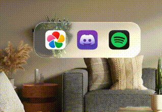

# 🍏 Liquid GL-Ass

Revolutionary. Unprecedented. Incredibly brave.
We’ve redefined what it means to render translucent rectangles with blur.

**Try it here: https://bergice.github.io/liquidglass/**

### Quotes from people who drank the Kool-Aid

> People mocking Apple’s new liquid glass clearly don’t understand what they’re looking at. Glass is one of the hardest materials to render cleanly without visual noise - pulling it off this well is a huge technical flex. And no, Vista wasn’t even close. If you’re comparing this to Vista, you’re either blind or just repeating what others say without thinking. Same crowd, same noise - noobs. 😄
> https://www.threads.com/@henris.kas/post/DKuzTRzMYOS?hl=en

> This is Liquid Glass — Apple’s another technological feat. And if you are comparing it with Vista, either you have forgotten about Windows Vista or you are just shouting in the void.
> Glass is the toughest thing to render. EVER. Apple has done a beyond marvelous job in creating this. Kudos.
> https://www.threads.com/@akshansschauhan/post/DKv1gayIc1k

### ✨ Features

* Cutting-edge refraction that says "I'm better than you"
* Edge glow so subtle you'll wonder if you're hallucinating
* Blur so smooth it makes your GPU question its existence
* 100% hand-crafted artisanal WebGL, sourced from fair-trade math

### F.A.Q

* **🤔 Why?**
Because Apple told us it was impossible.
Because some guy on Threads said glass is hard to render.
* **Who made this?**
An average programmer who never really dabbles with shader code.
* **How long did it take to make this?**
No, it didn't take 100 programmers years to build this. It took a couple of hours.
